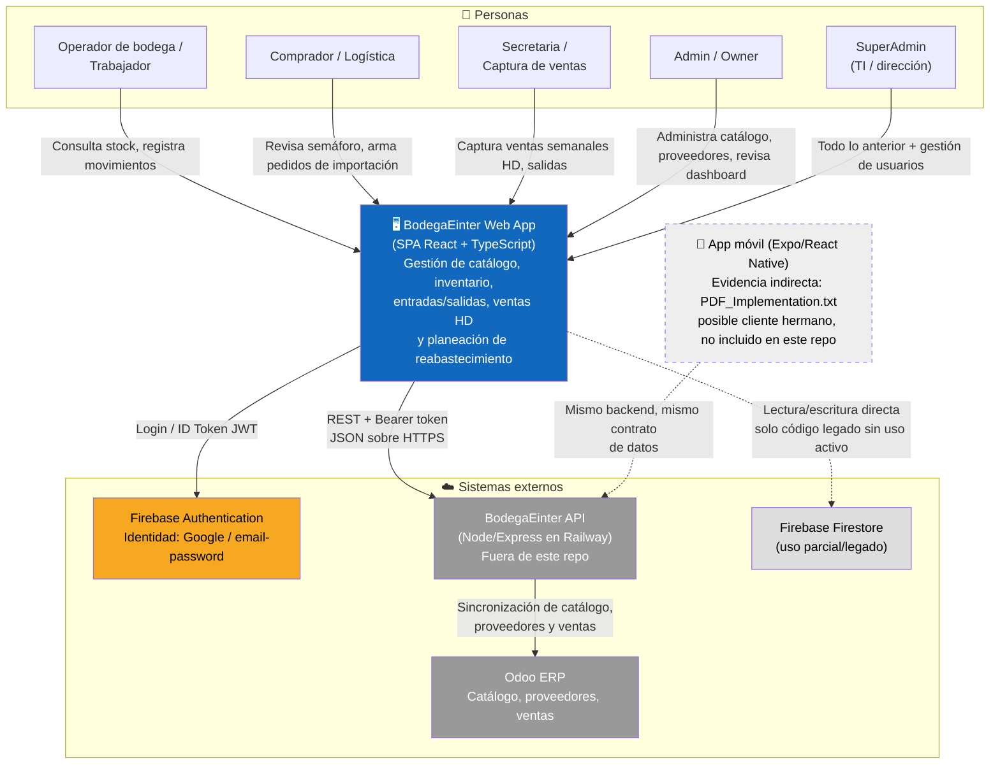
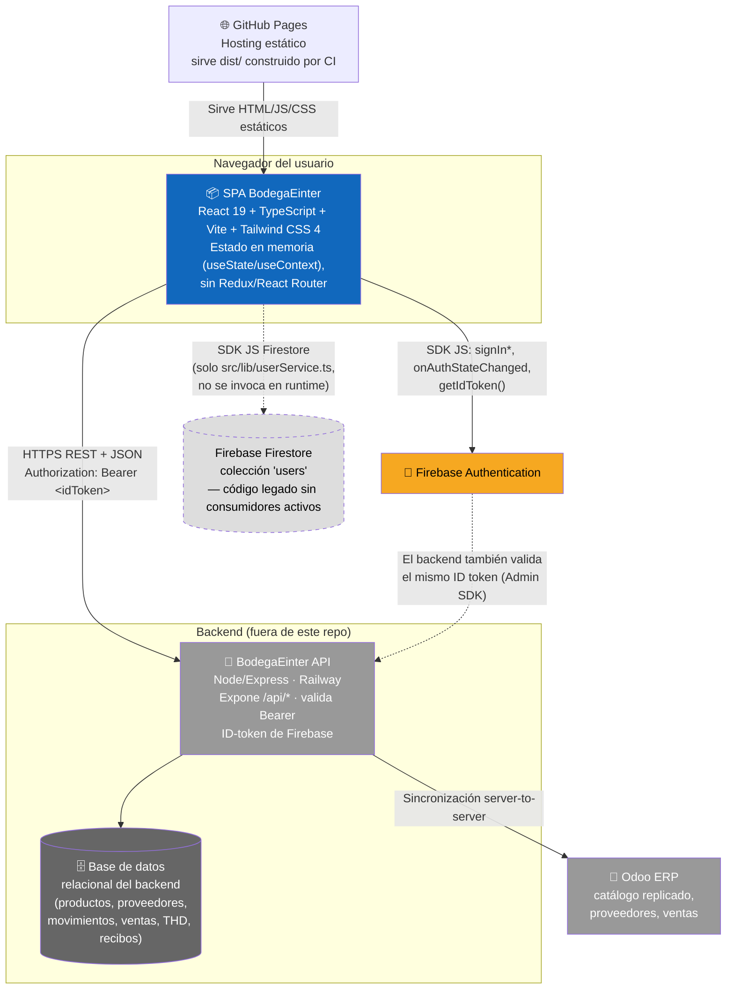
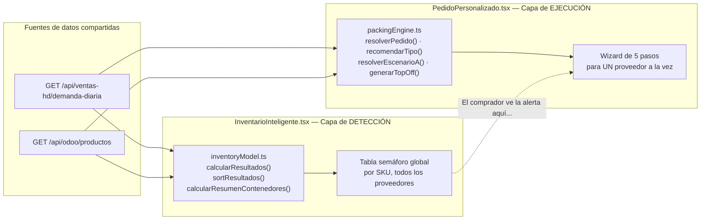
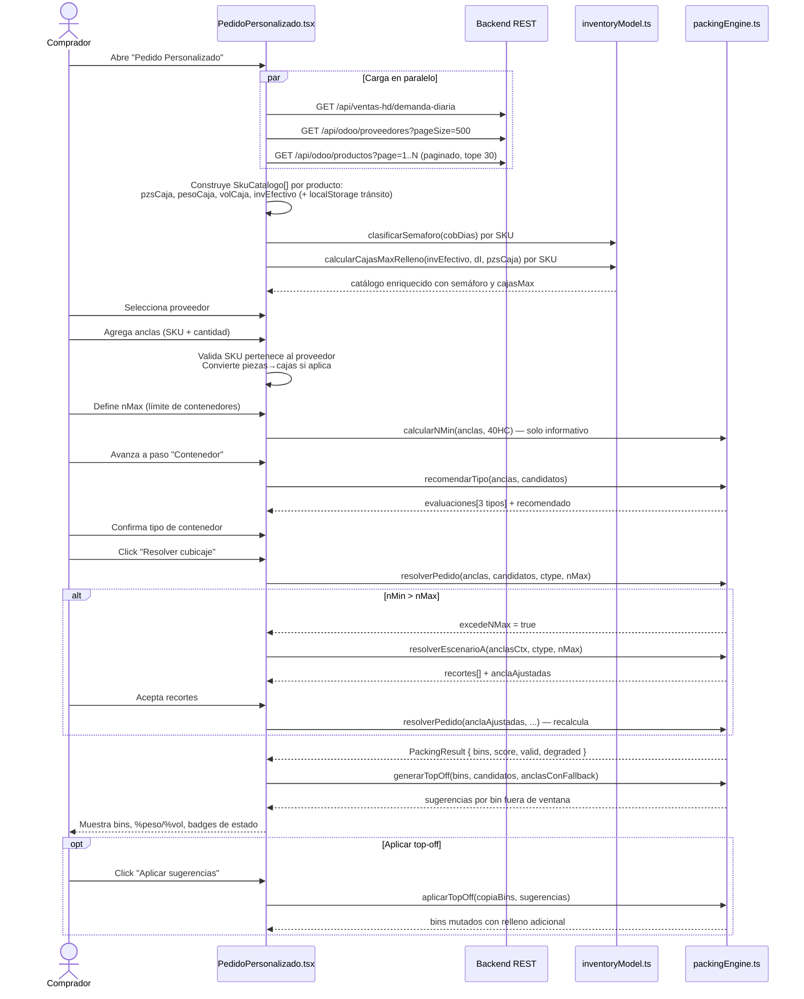

# Arquitectura de BodegaEinter (EinterWeb) — Documentación C4

> Documento generado a partir de una lectura exhaustiva del código fuente en `src/`.
> Modelo: [C4 Model](https://c4model.com/) (Contexto → Contenedores → Componentes → Código).
> Alcance: el frontend SPA de este repositorio (`EinterWeb`). El backend, Odoo y Firebase se documentan
> como sistemas externos porque su código no vive en este repo — se infiere su contrato desde cómo el
> frontend los consume.

---

## Tabla de contenidos

1. [Propósito y cómo leer este documento](#1-propósito-y-cómo-leer-este-documento)
2. [Resumen ejecutivo del sistema](#2-resumen-ejecutivo-del-sistema)
3. [Glosario de dominio](#3-glosario-de-dominio)
4. [Nivel 1 — Diagrama de Contexto](#4-nivel-1--diagrama-de-contexto)
5. [Nivel 2 — Diagrama de Contenedores](#5-nivel-2--diagrama-de-contenedores)
6. [Nivel 3 — Componentes](#6-nivel-3--componentes)
   - 6.1 [Cimientos de la app (shell, contextos, routing por estado)](#61-cimientos-de-la-app)
   - 6.2 [Autenticación y autorización](#62-autenticación-y-autorización)
   - 6.3 [Clientes HTTP (dos implementaciones paralelas)](#63-clientes-http)
   - 6.4 [Navegación (Sidebar / NavBar)](#64-navegación)
   - 6.5 [Componentes compartidos (modales, filtros, combobox)](#65-componentes-compartidos)
   - 6.6 [Dominio: Catálogo maestro](#66-dominio-catálogo-maestro)
   - 6.7 [Dominio: Operaciones de bodega](#67-dominio-operaciones-de-bodega)
   - 6.8 [Dominio: Ventas y Home Depot](#68-dominio-ventas-y-home-depot)
   - 6.9 [Dominio: Inteligencia de inventario](#69-dominio-inteligencia-de-inventario)
   - 6.10 [Dashboard (Home)](#610-dashboard-home)
   - 6.11 [Administración de usuarios](#611-administración-de-usuarios)
   - 6.12 [Componentes huérfanos / no integrados](#612-componentes-huérfanos--no-integrados)
7. [Nivel 4 — Código: los dos motores matemáticos](#7-nivel-4--código-los-dos-motores-matemáticos)
   - 7.1 [`inventoryModel.ts` — Modelo predictivo de reabastecimiento](#71-inventorymodelts--modelo-predictivo-de-reabastecimiento)
   - 7.2 [`packingEngine.ts` — Motor de cubicaje](#72-packingenginets--motor-de-cubicaje)
   - 7.3 [Flujo end-to-end: de la API al contenedor físico](#73-flujo-end-to-end-de-la-api-al-contenedor-físico)
8. [Modelo de datos compartido (`types.ts`)](#8-modelo-de-datos-compartido-typests)
9. [Infraestructura, build y despliegue](#9-infraestructura-build-y-despliegue)
10. [Mapa completo de endpoints REST consumidos](#10-mapa-completo-de-endpoints-rest-consumidos)
11. [Deuda técnica y hallazgos de consistencia](#11-deuda-técnica-y-hallazgos-de-consistencia)

---

## 1. Propósito y cómo leer este documento

Este documento explica **por qué existe cada pieza** de BodegaEinter, no solo qué hace. Para cada
componente se responde: *¿qué problema de negocio de una bodega/importadora resuelve?*, *¿con qué otros
componentes habla?*, *¿qué endpoints consume?* y *¿qué reglas de negocio no triviales aplica?*.

Está pensado para alguien que nunca ha visto el código pero conoce el negocio (compras, logística,
bodega, ventas a Home Depot), y también para un desarrollador nuevo que necesita saber dónde tocar
cuando se le pide un cambio.

---

## 2. Resumen ejecutivo del sistema

**BodegaEinter** es el sistema interno de gestión de bodega e importación de la empresa Einter. Es una
**SPA (Single Page Application)** en React 19 + TypeScript + Vite, servida como sitio estático en
**GitHub Pages**, que no tiene backend propio: todos los datos de negocio (productos, proveedores,
ventas, movimientos, órdenes) viven en un **backend REST externo** (Node/Express, desplegado en Railway),
el cual a su vez se sincroniza con **Odoo** (el ERP donde vive la "fuente de verdad" comercial: ventas,
catálogo replicado, proveedores). La autenticación de personas la resuelve **Firebase Authentication**
(login con Google o email/password); el backend valida el ID token de Firebase en cada request y decide
el rol interno del usuario.

El sistema resuelve tres problemas de negocio encadenados:

1. **Mantener el catálogo maestro** (productos, categorías, proveedores, ubicaciones) con los datos
   físicos (peso, dimensiones, piezas por cartón) que luego alimentan los cálculos logísticos.
2. **Registrar el movimiento físico de mercancía**: qué entra (contenedores/`Entradas`), qué sale
   (`Salidas`, ventas a Home Depot), y conciliar lo pedido contra lo realmente surtido (`THDComparativo`).
3. **Decidir qué y cuánto volver a pedir, y cómo empacarlo**: dos motores matemáticos puros en
   TypeScript (`inventoryModel.ts` y `packingEngine.ts`) implementan, respectivamente, un modelo
   predictivo de reabastecimiento (semáforo rojo/amarillo/verde por SKU) y un motor de cubicaje
   (bin-packing) que arma pedidos de importación optimizados para llenar contenedores marítimos
   (20ft/40ft/40HC).

No existe otro cliente en este repo, pero el código (`PDF_Implementation.txt`, convenciones `app/(api)/`)
deja evidencia de que **existió o existe una app hermana en Expo/React Native** que comparte el mismo
backend — es decir, este SPA es uno de potencialmente varios clientes del mismo sistema de backend.

---

## 3. Glosario de dominio

| Término | Significado en este sistema |
|---|---|
| **SKU / MOD / `master_sku`** | Identificador interno de un producto. "MOD" es el nombre que usa el equipo comercial; en la base de datos y en Odoo aparece como `master_sku` / `default_code`. Es la clave que cruza catálogo, demanda, inventario y comparativos. |
| **THD** | "THD" = Home Depot (cliente ancla del negocio). Aparece en `THDComparativo`, `/api/thd/*`, `ventas-hd`. |
| **Folio** | Identificador de una sub-entrega dentro de una orden de venta (`Salidas`). Una orden puede tener varios folios, cada uno con su propia lista de productos. |
| **Contenedor (logístico)** | Contenedor marítimo de importación: `20ft` (21,700 kg / 33.0 m³), `40ft` (26,500 kg / 67.0 m³), `40HC` (26,500 kg / 76.0 m³ — "High Cube", más alto). Constantes en `packingEngine.ts` (`CONTAINER_SPECS`) e `inventoryModel.ts` (`CONTENEDORES`). |
| **Ancla** | En el motor de cubicaje: un SKU que el usuario **elige explícitamente** incluir en el pedido (define la columna vertebral del contenedor). Se coloca primero, con First-Fit-Decreasing. |
| **Relleno (candidato)** | Un SKU que el algoritmo **sugiere automáticamente** para aprovechar el espacio que quedó libre tras colocar las anclas, priorizado por urgencia de reabastecimiento y compatibilidad de densidad peso/volumen. |
| **Ventana óptima** | Rango de llenado que un contenedor "bien armado" debe alcanzar: 50–95% del peso máximo y 75–90% del volumen máximo. Si un contenedor queda fuera de esa ventana, el sistema lo marca como *degradado* o *inválido* y sugiere *top-off*. |
| **Top-off** | Sugerencias automáticas para "rematar" un contenedor que quedó fuera de la ventana óptima, agregando cajas de SKUs de relleno o, como último recurso, más cajas de las propias anclas. |
| **Escenario A** | Estrategia de recorte: cuando las anclas elegidas por el usuario exceden el número máximo de contenedores permitido (`nMax`), el motor recorta cajas de las anclas menos urgentes/valiosas hasta que quepan, y reporta qué recortó y por qué. |
| **Semáforo de inventario** | Clasificación de cada SKU según días de cobertura de inventario: `rojo` (crítico, < 60 días), `amarillo` (alerta, 60–80 días), `verde` (OK), `sin_datos` (sin demanda histórica conocida), `sobrestock` (> 2× el objetivo de cobertura). |
| **Días de cobertura** | `inventario_efectivo / demanda_diaria`. Cuántos días dura el stock actual (+ lo que ya viene en tránsito) al ritmo de venta actual. |
| **Lead time** | Días que tarda en llegar un pedido desde que se hace hasta que está disponible en bodega (default 60 días). |
| **Odoo** | ERP externo con el que el backend se sincroniza (catálogo de productos, proveedores, ventas). Varias pantallas del frontend consumen rutas `/api/odoo/*` que en realidad son un *proxy/réplica* del backend hacia Odoo. |

---

## 4. Nivel 1 — Diagrama de Contexto

Quién usa el sistema y con qué otros sistemas externos interactúa, sin entrar en detalles internos.

**Notas de contexto:**

- No hay un backend en este repositorio: todo `import.meta.env.VITE_API_BASE_URL` apunta a un servicio
  externo (en desarrollo, `vite.config.ts` hace proxy de `/api` a `http://localhost:3000/`, con un
  comentario apuntando también a `https://einterapi-production.up.railway.app/` como destino de
  producción).
- Odoo no es consumido directamente por el frontend; siempre pasa por el backend bajo el namespace
  `/api/odoo/*`. El frontend lo trata como si fuera parte del propio backend.
- Firestore (`src/lib/userService.ts`, `src/lib/firebase.ts` → `getFirestore`) es alcanzable desde el
  cliente, pero en la práctica **ningún componente activo lo usa** — es un vestigio de una arquitectura
  anterior donde probablemente los roles de usuario se gestionaban en Firestore directamente, antes de
  migrar esa responsabilidad al backend REST (`/api/auth/*`). Ver [sección 11](#11-deuda-técnica-y-hallazgos-de-consistencia).

---

## 5. Nivel 2 — Diagrama de Contenedores

Los "contenedores" en sentido C4 (unidades desplegables/ejecutables), no confundir con los contenedores
marítimos del dominio de negocio.

### 5.1 Ciclo de vida de build/despliegue

| Etapa | Herramienta | Detalle |
|---|---|---|
| Desarrollo local | `vite dev` (`npm run dev`) | Proxy de `/api` → `http://localhost:3000/` (backend corriendo localmente) |
| CI (cada push/PR a `main`/`develop`) | `.github/workflows/ci-cd.yml` | `npm ci` → `eslint` → `tsc --noEmit` → `vite build`, matriz Node 20.19.x / 22.x |
| Deploy (push a `main`) | `.github/workflows/deploy.yml` | `vite build` con secretos `VITE_FIREBASE_*` inyectados → publica `dist/` a GitHub Pages vía `actions/deploy-pages` |
| Producción | GitHub Pages (estático) | `VITE_API_BASE_URL` debe apuntar al backend público (Railway); sin esa variable, el build de producción cae al fallback `http://localhost:3000` (ver `src/lib/api.ts`), lo cual **rompería la app en producción si la variable no está configurada como secreto** |

`index.html` + `public/404.html` implementan el truco estándar de
[spa-github-pages](https://github.com/rafgraph/spa-github-pages): como GitHub Pages no soporta rutas de
SPA sin recargar, `404.html` redirige cualquier ruta desconocida a `/?p=<ruta original>`, y un script
inline en `index.html` restaura la ruta con `history.replaceState`. En la práctica, sin embargo, esta app
**no usa un router de URL** (ver 6.1) — toda la navegación interna es un `switch` sobre estado de React,
así que este mecanismo solo importa si alguien comparte/recarga un link directo a una subruta.

---

## 6. Nivel 3 — Componentes

### 6.1 Cimientos de la app

| Archivo | Razón de ser |
|---|---|
| `src/main.tsx` | Punto de entrada. Monta `<App/>` envuelto en `<AuthProvider>` (el árbol entero necesita saber quién es el usuario antes de decidir qué mostrar). Importa `./lib/fetch` únicamente por su *side effect*: registra `window.fetchAPI` global. |
| `src/App.tsx` | **El "router" de la aplicación.** No hay `react-router-dom`; en su lugar, `useState('home')` guarda el nombre de página activa y un `switch` (`renderPage()`) decide qué componente de página montar. Esta decisión de diseño (deliberada o no) implica: (a) no hay URLs profundas navegables/compartibles hacia una página concreta, (b) el botón "atrás" del navegador no funciona como cabría esperar en una SPA convencional, (c) cambiar de página es instantáneo (no hay lazy-loading de rutas, todo el bundle de páginas ya está cargado). También decide el *gate* raíz: si `loading` (aún resolviendo sesión de Firebase) muestra un loader; si no hay `user`, renderiza `<Login/>` en vez del layout autenticado; solo la ruta `users` está protegida explícitamente con `<RoleGuard requireSuperAdmin>`. |
| `src/context/AuthContext.tsx` | Ver [6.2](#62-autenticación-y-autorización). |
| `src/context/DarkModeContext.tsx` | Estado global de modo oscuro, persistido en `localStorage` bajo la key `darkMode` y reflejado como clase `dark` en `document.documentElement` (consumida por el *variant* `@variant dark` de Tailwind 4 en `src/index.css`). Envuelve el layout autenticado (no el `<Login/>`, que no tiene toggle de tema). Existe como contexto separado de `AuthContext` porque es una preferencia de UI pura, sin relación con la sesión del usuario ni con el backend. |
| `src/index.css` | Import de Tailwind 4 (`@import "tailwindcss"`) + definición del variant `dark` + keyframes de animación reutilizados en toda la app (`fadeIn`, `fadeInUp`, `slideIn`, etc., usados sobre todo en `Sidebar.tsx`). |
| `src/App.css` | **Vestigio del template de Vite/React.** No se importa desde ningún archivo — código muerto que se puede borrar sin efecto. |

### 6.2 Autenticación y autorización

**Razón de ser:** separar "¿quién eres?" (identidad, resuelta por Firebase) de "¿qué puedes hacer?" (rol
de negocio, resuelto por el backend propio). Esta separación explica por qué existen *dos* fuentes de
verdad sobre el usuario en el cliente: el objeto `User` de Firebase (foto, nombre, email, uid) y
`BackendUserData` (rol, `id_usuario`, estado activo) — el primero identifica, el segundo autoriza.

| Pieza | Rol en el flujo |
|---|---|
| `src/lib/firebase.ts` | Inicializa el SDK de Firebase (`initializeApp`) con config leída de variables `VITE_FIREBASE_*`. Exporta `auth` (Authentication) y `db` (Firestore) — este último prácticamente sin consumidores activos. |
| `src/context/AuthContext.tsx` | Orquesta todo el ciclo de vida de sesión. Se suscribe a `onAuthStateChanged`; en cada cambio (login/logout/refresh de página): obtiene el ID token de Firebase (`user.getIdToken()`), lo guarda en el módulo `api.ts` vía `setAuthToken(idToken)`, y **llama al backend** (`loginToBackend`) para obtener el perfil real (`BackendUserData`, incluyendo `role`). Expone `signInWithGoogle`, `signInWithEmail`, `signUpWithEmail`, `logout`, `resetPassword`, `refreshUserData`. |
| `src/lib/roles.ts` | Fuente única de verdad sobre los 6 roles del sistema y su jerarquía numérica: `superadmin(6) > owner(5) > admin(4) > secretaria(3) > trabajador(2) > empleado(1)`. `hasPermission(userRole, requiredRole)` compara por número, es decir, **es una jerarquía acumulativa** (un `owner` automáticamente cumple cualquier requisito pensado para `admin` o inferior). |
| `src/hooks/useRole.ts` | Adapta `AuthContext` a un API más cómodo para componentes: `{ role, isSuperAdmin, hasPermission(role), isRole(role), loading }`. |
| `src/components/RoleGuard.tsx` | Componente de guardia declarativo: `<RoleGuard requireSuperAdmin fallback={<Denegado/>}>{children}</RoleGuard>`. Es el **único** punto del árbol de páginas donde se aplica en la práctica (envolviendo `UserManagement` en `App.tsx`); ningún otro dominio (Productos, Proveedores, Movimientos, etc.) restringe por rol a nivel de UI. |
| `src/components/LoginButton.tsx` / `src/components/LogoutButton.tsx` | Botones finos sobre `useAuth()`. `LoginButton` maneja específicamente los códigos de error de Firebase para pop-ups (`auth/popup-blocked`, `auth/popup-closed-by-user`, `auth/cancelled-popup-request`) con mensajes en español. `LogoutButton` está definido pero **no se usa** en ningún lado activo — el logout real ocurre desde el menú desplegable de `NavBar.tsx`, que reimplementa su propio botón inline en vez de reutilizar este componente. |
| `src/pages/Login.tsx` | Pantalla de login. Solo ofrece Google (vía `LoginButton`) — a pesar de que `AuthContext` expone `signInWithEmail`/`signUpWithEmail`/`resetPassword`, **no hay ningún formulario en la UI que los use** actualmente; son capacidades del contexto sin consumidor visible. |
| `src/components/Profile.tsx` | Vista de solo lectura del perfil de Firebase (foto, nombre, email). Es la página `profile` a la que navega el ítem "Ver Perfil" del menú de usuario en `NavBar`. |

**¿Por qué "sign out" si falla el backend?** En `AuthContext`, si `loginToBackend(idToken)` lanza un error
(p. ej. el backend está caído, o CORS mal configurado), el `catch` llama a `signOut(auth)` y deja
`userData`/`userRole` en `null`. Es una decisión de diseño explícita: **la sesión de Firebase por sí sola
nunca es suficiente para usar la app** — sin una respuesta válida del backend con rol asignado, se
considera al usuario no autenticado, incluso si Firebase sí lo reconoce. Esto evita que alguien con cuenta
de Google válida pero sin usuario dado de alta en el backend quede "medio adentro" de la aplicación.

### 6.3 Clientes HTTP

Existen **dos implementaciones independientes** de cliente HTTP, no una capa única — una inconsistencia
documentada aquí porque es clave para entender por qué el comportamiento de refresco de token difiere
entre pantallas.

| | `src/lib/fetch.ts` (`fetchAPI`) | `src/lib/api.ts` (objeto `api`) |
|---|---|---|
| **Quién lo usa** | La mayoría de las páginas de dominio: Productos, Proveedores, Categorías, Movimientos, Entradas, Salidas, THDComparativo, VentasHomeDepot, InventarioInteligente, PedidoPersonalizado, ReciboModal, ProductModal | `AuthContext` (login/perfil), `Home.tsx`, `UserManagement.tsx` |
| **Token** | Pide un ID token **fresco** en cada llamada: `auth.currentUser.getIdToken(true)` (fuerza refresh contra Firebase) | Usa un token **cacheado en memoria** (`currentIdToken`), fijado una sola vez por `setAuthToken()` cuando cambia el estado de auth |
| **Normalización de ruta** | Convierte el prefijo legado `/(api)/` a `/api/` automáticamente (compatibilidad con código portado, ver 6.12) | No normaliza nada; espera rutas ya correctas (`/api/...`) |
| **Manejo de errores** | Detecta respuestas no-JSON (p. ej. HTML de un 404 de gateway o el propio `index.html` de la SPA) y lanza un mensaje explicativo orientado a diagnóstico ("revisa que el backend esté corriendo...") | Mensaje genérico `HTTP {status}: {statusText}` si el body no es JSON parseable |
| **Expuesto globalmente** | Sí, como `window.fetchAPI` (registrado en `main.tsx`) | No |
| **Por qué existen ambos** | No documentado explícitamente en el código; el patrón sugiere que `api.ts` es la capa **más antigua** (nombres de método curados: `getProductos`, `createUser`...) construida alrededor del flujo de autenticación, y `fetchAPI` es una capa **más genérica y posterior** adoptada por la mayoría de páginas de dominio para tener control fino sobre normalización de rutas y mensajes de error. |

### 6.4 Navegación

| Componente | Razón de ser |
|---|---|
| `src/components/Sidebar.tsx` | Menú lateral fijo con los 12 (o 13, si superadmin) destinos de la app. Cada ítem es un botón que llama a `onNavigate(id)`, el cual simplemente actualiza el `useState('home')` de `App.tsx` — no hay concepto de URL. El ítem "Usuarios" solo se agrega al arreglo si `useRole().isSuperAdmin` es verdadero (primera capa de las dos que protegen esa pantalla, ver [6.2](#62-autenticación-y-autorización)). También aloja el toggle de modo oscuro/claro. En móvil colapsa a un botón hamburguesa (`isOpen` local). |
| `src/components/NavBar.tsx` | Barra superior fija con el logo "EINTER" centrado y un menú desplegable de perfil (foto, nombre, email, "Ver Perfil", "Cambiar Contraseña" — este último botón **no tiene `onClick`**, es decorativo/pendiente —, y "Cerrar Sesión"). Cierra el dropdown al hacer click fuera (`useRef` + listener de `mousedown`). |

### 6.5 Componentes compartidos

Piezas reutilizadas por varias páginas de dominio para no repetir UI de tabla/formulario.

| Componente | Razón de ser | Usado por |
|---|---|---|
| `src/components/ColumnFilter.tsx` | Filtro "estilo Excel": dropdown con ordenamiento asc/desc + checklist de valores distintos de una columna, posicionado con `position: fixed` calculado en runtime (para no quedar recortado por el `overflow-hidden` de la tarjeta de tabla contenedora). Expone también la función utilitaria `distinctValues<T>(rows, accessor)`. | Productos, Movimientos, Entradas, THDComparativo, Salidas |
| `src/components/SkuCombobox.tsx` | Input de autocompletar SKU/modelo con un menú flotante renderizado vía `createPortal(document.body)` (para escapar de contenedores con `overflow: hidden` de los modales), filtra hasta 50 coincidencias por SKU o nombre, y recalcula su posición en scroll/resize. | Entradas (`Entradas.tsx`, no detallado línea por línea en este documento pero referenciado en `docs/OrdenHD-ComparativoHD-Salidas.md`) |
| `src/components/DeleteConfirmModal.tsx` | Modal de confirmación de borrado con prop `productName` (mensaje específico a "producto"). | `Productos.tsx`, `Proveedores.tsx` |
| `src/components/DeleteCategoryConfirmModal.tsx` | Segunda implementación de modal de confirmación, con props genéricas `title`/`message` (también exporta un símbolo llamado `DeleteConfirmModal`, lo que puede confundirse con el anterior al leer imports). | `Categorias.tsx` |
| `src/components/CategoryModal.tsx` | Modal de un solo campo (`name`) para crear/editar categoría. | `Categorias.tsx` |
| `src/components/VentaModal.tsx` / `src/components/VentaDetailModal.tsx` | Documentados en detalle en `docs/OrdenHD-ComparativoHD-Salidas.md` §5 — modal de alta/edición de órdenes de venta con folios múltiples y adjunto PDF, y modal de solo lectura de line items (locales o traídos de Odoo). | `Salidas.tsx` |

**Nota de consistencia:** existen **tres** implementaciones distintas de "modal de confirmación de
borrado" en el repo (las dos de la tabla más una tercera definida *inline* dentro de `Ubicaciones.tsx`),
y **dos** clientes HTTP. Ninguna es incorrecta por sí sola, pero reflejan crecimiento orgánico sin una
pasada de unificación — ver [sección 11](#11-deuda-técnica-y-hallazgos-de-consistencia).

### 6.6 Dominio: Catálogo maestro

Responde a la pregunta *"¿qué vendemos/importamos, quién nos lo provee, y cuánto pesa/mide cada caja?"*.
Estos datos maestros (peso, dimensiones, piezas por cartón) son el insumo directo de los motores
matemáticos de la [sección 7](#7-nivel-4--código-los-dos-motores-matemáticos).

> Hallazgo transversal: **ninguna** pantalla de este dominio usa `useRole`/`RoleGuard` — son accesibles a
> cualquier usuario autenticado, sin distinción de permisos de lectura/escritura/borrado a nivel de UI.

#### `src/pages/Productos.tsx` — CRUD de catálogo de productos

- **Por qué existe:** es la ficha maestra de cada SKU — nombre, proveedor, categoría, precio/costo,
  stock, foto, y crucialmente `weight_kg`, `dimensions_cm` y `qty_per_carton`, que son exactamente los
  campos que `packingEngine.ts` necesita para calcular peso/volumen por caja.
- **Carga "traer todo, paginar en cliente":** pide el catálogo completo a `GET /api/odoo/productos`
  iterando todas las páginas (`pageSize=200`) tanto para poblar la tabla como para exportar a Excel, de
  modo que el buscador y los filtros "estilo Excel" puedan operar sobre el universo completo de SKUs.
  Luego pagina 20 filas por página **en memoria**, no contra el servidor.
- **Refresco selectivo antes de editar:** al abrir el modal de edición, vuelve a pedir ese único producto
  (`GET /(api)/productos?id=`) para no editar sobre datos obsoletos si otro usuario lo cambió mientras
  tanto; si esa llamada falla, usa silenciosamente la copia ya en memoria como respaldo.
- **Sincronización a Odoo desacoplada:** tras crear o actualizar, dispara `POST
  /api/odoo/sync/producto/{id}` en segundo plano (fire-and-forget); si falla solo hace `console.warn` —
  el guardado en la base propia ya se considera exitoso independientemente de si Odoo se sincronizó.
- **Exportación a Excel** con `exceljs`, nombrando el archivo con la fecha actual en huso horario de
  Monterrey (`getMonterreyDateISO()`).
- Depende de: `ProductModal`, `DeleteConfirmModal`, `ColumnFilter`/`distinctValues`,
  `useRefetchOnFocus(fetchProducts)` (refresca si la pestaña recupera foco, con throttle de 15s).

#### `src/components/ProductModal.tsx` — formulario de alta/edición de producto

- **Compresión de imagen en el navegador:** al seleccionar una foto, la redimensiona en un `<canvas>`
  (ancho máx. 800px, manteniendo proporción) y la recodifica a JPEG calidad 0.5 antes de convertirla a
  base64 — evita subir fotos de varios MB tomadas directo de cámara/celular.
- Normaliza `category` (puede llegar como string, número u objeto `{id,name}`, según la fuente) a un
  `category_id` de string consistente para el `<select>`.
- Carga sus propios combos de proveedor (`GET /api/odoo/proveedores`) y categoría (`GET /api/categorias`)
  cada vez que se abre (`visible === true`), no una sola vez al montar la app.
- Validación mínima: `name` y `sku` obligatorios; el resto cae a `0` si no es numérico.
- **No llama a los endpoints de escritura de productos** — delega la persistencia real al callback
  `onSave` que le inyecta `Productos.tsx`.

#### `src/pages/Categorias.tsx` — CRUD de categorías con vista maestro-detalle

- **Por qué existe:** organiza el catálogo para filtrado, reportes y navegación; al seleccionar una
  categoría en el panel izquierdo, muestra en el panel derecho los productos que le pertenecen.
- **Cache en memoria por categoría ya visitada:** si el usuario reselecciona una categoría cuyos
  productos ya se cargaron en esta sesión, no vuelve a pedirlos al backend (aunque tampoco invalida ese
  cache si los productos cambian desde otra pantalla — solo se refresca completo con un reload manual de
  toda la vista).
- El endpoint `GET /api/categorias?id={id}` se interpreta de forma defensiva probando varias claves
  posibles en la respuesta (`productos`, `products`, `items`, `data`), evidencia de que el contrato de
  ese endpoint no ha sido 100% estable históricamente.
- Depende de `CategoryModal` y de `DeleteCategoryConfirmModal` (no del `DeleteConfirmModal` que usan
  Productos/Proveedores — ver nota de consistencia en [6.5](#65-componentes-compartidos)).

#### `src/pages/Proveedores.tsx` + `src/components/ProveedorModal.tsx` — CRUD de proveedores

- **Por qué existe:** mantiene el catálogo de proveedores referenciado desde Productos, y captura
  `lead_time` (tiempo de envío en días) — un parámetro que en teoría alimentaría el cálculo de punto de
  reorden.
- **Limitación relevante:** al mapear la respuesta de `GET /api/odoo/proveedores`, el campo `lead_time`
  se **fuerza a `0`** en el cliente sin importar lo que traiga el backend/Odoo — es decir, hoy la UI no
  refleja el lead time real capturado en Odoo, solo el que se edite manualmente desde `ProveedorModal`
  (campo `tiempo_envio`) y se guarde en la base propia del backend.
- Mismo patrón de sync a Odoo desacoplado que Productos (`POST /api/odoo/sync/proveedor/{id}`).
- `ProveedorModal` es un componente 100% controlado y sin fetch propio (a diferencia de `ProductModal`) —
  no hay combos que cargar.

#### `src/pages/Ubicaciones.tsx` — ⚠️ prototipo sin integración real

- **Lo que aparenta ser:** gestión de ubicaciones físicas de bodega (ej. "Bodega 1", "Bodega 2") con
  inventario por ubicación y botón de impresión de etiqueta.
- **Lo que realmente es:** una pantalla **completamente mockeada**. No importa `fetchAPI` ni ningún
  cliente HTTP; los datos vienen de una constante `sampleData` hardcodeada en el propio archivo (SKUs de
  ejemplo literalmente `"XXXX"`), y todas las operaciones CRUD solo mutan `useState` local — al recargar
  la página, cualquier cambio se pierde y reaparece el mock original. El botón de imprimir etiqueta no
  tiene `onClick`.
- Es relevante para la arquitectura porque el **modelo de datos ya existe** en el backend/tipos
  compartidos (`InventoryLocation`, `ProductLocation` en `src/lib/types.ts`, con campos como `tarimas`,
  `completas`, `distintas`, `escaneado`) — esta pantalla es la única pieza del dominio de catálogo
  pendiente de conectar, no una funcionalidad inexistente en el backend.

### 6.7 Dominio: Operaciones de bodega

Responde a *"¿qué entró, qué salió, y quién movió qué?"*.

#### `src/pages/Movimientos.tsx` — historial combinado de entradas y salidas

- **Por qué existe:** trazabilidad/auditoría — un log unificado de movimientos de inventario.
- **No existe un endpoint `/api/movimientos` dedicado.** La pantalla sintetiza el historial combinando
  `GET /api/odoo/entradas` + `GET /api/odoo/salidas` (ambos namespaces de integración con Odoo) y
  mapeando cada fila cruda al tipo interno `Movement`. Como el modelo de Odoo no expone usuario,
  ubicaciones ni tarima, esos campos se rellenan con `0` en el cliente — por eso las columnas "Desde" y
  "Hacia" siempre muestran `"—"` en pantalla (`0` es falsy en el renderer).
- El orden por defecto es `id_movimiento` descendente combinando ambas listas — como entradas y salidas
  probablemente tengan secuencias de ID independientes en Odoo, este orden combinado **no garantiza**
  cronología real entre un movimiento de entrada y uno de salida con IDs cercanos.
- Depende de `ColumnFilter`/`distinctValues`, `useRefetchOnFocus(fetchMovimientos)`.

#### `src/pages/Entradas.tsx` — gestión de órdenes de compra / contenedores entrantes

> Documentado exhaustivamente (tipos, los 9 endpoints REST, validaciones, filtros) en
> **`docs/OrdenHD-ComparativoHD-Salidas.md` §2**. Resumen de su razón de ser: registra qué productos
> llegan, en qué cantidad, en qué contenedor físico (`tamano`: `1X20`/`1X40`/`2X40`/`FULL`/`SENCILLO`) y
> cuándo, con adjunto de factura en PDF y seguimiento de `status_envio`
> (`pendiente`/`en_transito`/`entregado`/`cancelado`). Es el registro de la mitad "entrada" del flujo de
> inventario; su contraparte de "salida" son `Salidas.tsx` y `VentasHomeDepot.tsx`.

#### `src/components/ReciboModal.tsx` — ⚠️ componente huérfano

> Ver detalle en [6.12](#612-componentes-huérfanos--no-integrados).

### 6.8 Dominio: Ventas y Home Depot

Tres pantallas relacionadas con el mismo cliente ancla (Home Depot) pero con **propósitos de negocio
distintos** — es fácil confundirlas por nombre, así que se documentan siempre en conjunto.

| Pantalla | Unidad de dato | Pregunta de negocio que responde | Namespace API |
|---|---|---|---|
| `Salidas.tsx` | Orden de venta con folios y line items reales, ligada a inventario/Odoo | "¿Qué salió de bodega, a quién, con qué factura/PDF?" | (ventas Odoo-synced, ver doc de referencia) |
| `VentasHomeDepot.tsx` | Celda `(MOD, semana ISO)` → cantidad + importe, captura manual | "¿Cuánto le vendimos a Home Depot cada semana, por modelo, para reporting histórico?" | `/api/ventas-hd/*` |
| `THDComparativo.tsx` | Fila `(master_sku, sku_thd)` → pedido THD vs. salida real | "¿Cumplimos lo que Home Depot nos pidió? ¿Dónde hay discrepancia?" | `/api/thd/*` |

#### `src/pages/Salidas.tsx` + `VentaModal.tsx` + `VentaDetailModal.tsx`

> Documentado exhaustivamente en **`docs/OrdenHD-ComparativoHD-Salidas.md` §4** (tipos, 7 endpoints,
> flujo de creación paso a paso, validaciones). Resumen: gestiona órdenes de venta reales con múltiples
> folios, cada uno con sus propios productos/cantidades/precios, adjunto opcional de PDF (factura,
> convertido a base64 en el navegador), y sincronización con Odoo (`odoo_id`) para traer line items
> cuando la venta no los trae localmente. Al eliminar una venta, el backend **devuelve el stock** de sus
> productos — la única operación de este dominio con efecto secundario explícito sobre inventario.

#### `src/pages/VentasHomeDepot.tsx` — matriz de captura de ventas semanales

- **Por qué existe:** es una hoja de cálculo viva para que alguien (secretaria/admin) capture, semana a
  semana, cuántas piezas e importe se vendieron de cada modelo a Home Depot — un registro de reporting
  comercial, **sin** noción de folio, PDF ni vínculo directo a un movimiento de inventario físico (a
  diferencia de `Salidas.tsx`).
- Endpoints propios: `GET /api/ventas-hd?anio=` (matriz completa), `POST /api/ventas-hd` (una celda
  nueva), `PUT /api/ventas-hd/:id` (editar una celda). No hay `DELETE`. La captura de "nueva semana" hace
  un `POST` por cada fila con datos (bucle secuencial, no hay endpoint batch).
- **Cálculo de etiqueta de semana ISO en el cliente** (`isoWeekMonday` + `generarSemanaLabel`): deriva el
  lunes de una semana ISO a partir de año+número usando la regla "el 4 de enero siempre cae en la semana
  ISO 1", para poder generar semanas nuevas sin depender de que el backend calcule la etiqueta.
- **Semáforo de volumen de venta** hardcodeado en el propio componente (no configurable): celdas grises
  si `0`, blancas si `<100`, azules si `100–199`, verdes si `≥200` piezas — aplicado tanto en la tabla en
  pantalla como en el archivo Excel exportado con `exceljs` (encabezados fusionados por semana, columnas
  congeladas, autofiltro, totales por fila/columna).
- **Deliberadamente sin `useRefetchOnFocus`** — hay un comentario explícito en el código: un refetch de
  fondo pisaría el estado de captura en vivo del modal de "nueva semana" mientras el usuario está
  escribiendo sin haber guardado todavía.
- Usa `fetchAPI` directamente (no pasa por `src/lib/api.ts`).

#### `src/pages/THDComparativo.tsx` — conciliación pedido vs. salida real

> Documentado exhaustivamente en **`docs/OrdenHD-ComparativoHD-Salidas.md` §3** (tipos, 3 endpoints,
> definición de status, panel expandido de discrepancia). Resumen: importa el Excel de pedidos de Home
> Depot (`POST /api/thd/upload`), lo compara SKU por SKU contra las salidas reales del sistema
> (`GET /api/thd/comparativo`), calcula `% de cumplimiento` y clasifica cada fila como `completo` (100%),
> `parcial` (50–99%), `sin_entrega` (<50%) o `sin_pedido` (no hay orden de compra THD para ese SKU). Si
> hay discrepancia, un panel expandido permite registrar manualmente la cantidad real que salió
   (`PATCH /api/thd/discrepancia/:folio`), con notas justificando la diferencia (ej. "faltaron 15 piezas
  por daño en tránsito").

### 6.9 Dominio: Inteligencia de inventario

El corazón analítico del sistema. Dos pantallas consumen los dos motores matemáticos puros documentados
a fondo en la [sección 7](#7-nivel-4--código-los-dos-motores-matemáticos), pero **resuelven problemas
distintos y complementarios**:

#### `src/pages/InventarioInteligente.tsx` — dashboard de alertas de reabastecimiento

- **Por qué existe:** responde *"¿qué SKUs se están por quedar sin stock, y cuánto necesito pedirle a
  cada proveedor?"* para **todos** los productos y **todos** los proveedores a la vez, como vigilancia
  continua (se refresca solo al recuperar foco de pestaña, vía `useRefetchOnFocus`).
- **Transformación de datos:** pagina `GET /api/odoo/productos` (hasta 30 páginas de 100, tope de
  seguridad) y cruza cada fila con `GET /api/ventas-hd/demanda-diaria` (mapa `mod → demanda_diaria`) para
  construir el `ProductoInput` que exige `inventoryModel.ts`. El cruce es por la clave string `mod` ==
  `master_sku` == `default_code` de Odoo (documentado con un comentario explícito en el código). Si la
  llamada de demanda falla, el catch queda vacío a propósito — el modelo simplemente mostrará
  `sin_datos` para esos SKUs en vez de romper la pantalla.
  `pzsEnTransito` es siempre `0` en esta pantalla (no hay fuente de "en tránsito" conectada aquí).
- **Interactividad sobre el modelo puro:** un panel de parámetros permite al usuario editar en vivo
  `leadTimeDias`, `diasObjetivo`, `alertaRojo`, `alertaAmarillo`, `minPzsSku` — cualquier cambio
  recalcula `resultados` de inmediato (recomputación reactiva vía `useMemo`, sin botón "aplicar").
- **Pestaña "Semáforo":** tabla paginada (50 filas/página) con SKU, proveedor, stock, demanda diaria,
  días de cobertura y badge de estado; tarjetas resumen clicables que actúan como filtro rápido por
  color de semáforo.
- **Pestaña "Contenedores":** agrupa por proveedor los SKUs en alerta y estima, para cada uno de los 3
  tipos de contenedor, el % de llenado — **es un resumen agregado, no un cubicaje real** (no invoca nada
  de `packingEngine.ts`); marca con un badge el tipo recomendado según `calcularResumenContenedores`.

#### `src/pages/PedidoPersonalizado.tsx` — asistente de cubicaje por proveedor

- **Por qué existe:** responde *"ya sé que necesito pedirle X a este proveedor, ¿cómo distribuyo las
  cajas entre 1 o más contenedores para maximizar el aprovechamiento de peso/volumen, y qué más me
  conviene meter de relleno?"* — es la herramienta de decisión logística fina que usaría compras antes de
  emitir una orden de importación real.
- **Wizard de 5 pasos** (`step`): `proveedor → anclas → límite de contenedores → tipo de contenedor →
  resultado`, con un stepper visual y botón "Nuevo pedido" para reiniciar.
- **Anclas elegidas a mano:** el usuario busca un SKU del proveedor seleccionado, captura cantidad (en
  piezas o cajas, con conversión automática `Math.ceil(piezas / piezas_por_caja)`), y el sistema valida
  que el SKU pertenezca a ese proveedor. Si el SKU está en estado `SOBRESTOCK`, pide confirmación
  explícita (`window.confirm`) antes de agregarlo como ancla. Si al SKU le faltan dimensiones/peso, se
  agrega igual pero se excluye de la lista de candidatos de relleno automático.
- **Fuente de "en tránsito" distinta a la otra pantalla:** aquí las piezas en tránsito se leen de
  `localStorage` (clave `einter_inv_transito`) en vez de venir de un endpoint — y **nada en el repo
  escribe actualmente esa clave**, por lo que en la práctica siempre vale `0` salvo que se inyecte
  manualmente desde la consola del navegador. Es una capacidad prevista pero sin UI para alimentarla.
- **Invoca prácticamente todo el catálogo de funciones de `packingEngine.ts`** — ver tabla detallada en
  [7.3](#73-flujo-end-to-end-de-la-api-al-contenedor-físico).
- **Manejo defensivo de estado mutable:** el motor (`aplicarTopOff`) muta los `bins` *in place*, así que
  la pantalla clona profundamente el resultado de `resolverPedido` antes de permitir que el usuario
  aplique sugerencias de top-off, para no corromper el resultado "puro" original ni el estado de React.
- **Deliberadamente sin `useRefetchOnFocus`** — recargar el catálogo en medio del wizard reiniciaría el
  paso a "proveedor" y el usuario perdería su progreso; hay un comentario explícito justificando la
  omisión.
- No exporta a Excel (a diferencia de `VentasHomeDepot.tsx` y `Productos.tsx`).

### 6.10 Dashboard (Home)

#### `src/pages/Home.tsx` — pantalla de aterrizaje

- **Por qué existe:** da al administrador un resumen ejecutivo al iniciar sesión — ventas del canal Home
  Depot (semanal/mensual), pedidos pendientes de llegar, productos con riesgo de quiebre, y un catálogo
  rápido para "imprimir" códigos QR.
- Único consumidor activo del endpoint agregador `GET /api/misc/dashboard` (trae KPIs, series de ventas y
  alertas ya calculadas del lado del backend) + `GET /api/productos?pageSize=50` para el selector de QR.
  Es, junto con `AuthContext` y `UserManagement`, de las pocas pantallas que usa el objeto `api` de
  `src/lib/api.ts` en vez de `fetchAPI`.
- **Normalización de series de tiempo:** genera siempre 6 claves `YYYY-MM` ancladas a
  `getMonterreyNow()` y rellena con `0` los meses sin datos del backend, para que la gráfica de línea
  nunca muestre menos de 6 puntos.
- **Reinterpretación local del semáforo:** cada producto en alerta trae `diasCobertura` y un semáforo ya
  calculado por el backend (`CRITICO`/`ALERTA`), pero el componente aplica **su propio** umbral visual
  (60 u 80 días según el caso) para dibujar la barra de progreso — es decir, reescala el dato del backend
  con una lógica de presentación local, no lo muestra en bruto.
- Gráficas SVG hechas a mano (sin librería de charts): `BarChart` (ventas por semana) y `LineChart`
  (ventas mensuales con área rellena), ambas con un algoritmo de "nice max" (`Math.ceil(max/5000)*5000`,
  etc.) para que las líneas guía del eje Y caigan en números redondos.
- **El módulo de impresión de QR es enteramente simulado**: no llama a ningún endpoint ni driver de
  impresora real; el `setTimeout` de 1.5s y el mensaje de éxito son decorativos, la lista de impresoras
  (Zebra ZD420, HP LaserJet 1020, etc.) está hardcodeada, y el propio "QR" (`FakeQR`) es un patrón SVG
  estático, no un código QR real generado a partir del SKU.
- Usa `useRefetchOnFocus(load)` para mantener el dashboard fresco en sesiones largas.

### 6.11 Administración de usuarios

#### `src/pages/UserManagement.tsx` — panel exclusivo de superadmin

- **Por qué existe:** dar de alta/baja y administrar el perfil de las personas con acceso al sistema,
  sin necesidad de tocar la base de datos directamente.
- **Doble candado de acceso:** el ítem de menú solo aparece en el `Sidebar` si `isSuperAdmin`, **y**
  `App.tsx` envuelve la ruta en `<RoleGuard requireSuperAdmin fallback={<AccesoDenegado/>}>` — es la
  única pantalla de todo el dominio de negocio con control de acceso explícito por rol.
- CRUD completo vía el objeto `api` (`src/lib/api.ts`): `getAllUsers`, `updateUserProfile`,
  `toggleUserActive`, `createUser`, `deleteUser` — todos contra `/api/auth/users*`.
- **Hallazgo relevante:** `api.ts` también expone `updateUserRole(id, role)` (`PATCH
  /api/auth/users/:id` con `{ rol: role }`), pero **`UserManagement.tsx` nunca la invoca** — no hay
  ningún selector ni control en la UI para cambiar el rol de un usuario existente; el rol se muestra
  únicamente como badge de solo lectura. El endpoint existe en la capa de API y presumiblemente en el
  backend, pero la funcionalidad de reasignar rol **no está conectada a ninguna interfaz** en este
  momento.
- Edición en dos llamadas separadas: `handleSaveEdit` siempre llama a `updateUserProfile`, y **solo si**
  cambió el toggle de activo/inactivo, hace una segunda llamada a `toggleUserActive` — son dos endpoints
  del backend combinados condicionalmente en un único submit de formulario.
- Eliminar usuario usa el `confirm()` nativo del navegador (no un modal custom, a diferencia del resto de
  la app).
- Usa `useRefetchOnFocus(loadUsers)` con el throttle estándar de 15s.

### 6.12 Componentes huérfanos / no integrados

Piezas de código presentes en el repo, completas y funcionales en su propio alcance, pero **sin ningún
componente activo que las use** hoy. Se documentan explícitamente porque en un análisis de arquitectura
suelen generar confusión ("¿dónde se usa esto?") si no se marcan como tales.

| Archivo | Estado | Evidencia |
|---|---|---|
| `src/components/ReciboModal.tsx` | Huérfano | Formulario completo de alta/edición de "Recibo" (orden de compra: proveedor, folio, fecha, ETA, líneas de producto, PDF en base64). `App.tsx` no lo importa y ninguna página del repo lo referencia. El único rastro externo es `PDF_Implementation.txt` en la raíz, que documenta este mismo componente pero usando convenciones de **Expo/React Native** (`app/(api)/recibos+api.ts`, `expo-document-picker`, nombre de proyecto "AplicativoApp") — evidencia de que fue portado desde una app móvil hermana y quedó sin integrar en este SPA. |
| `src/lib/userService.ts` | Huérfano | CRUD completo de usuarios **directo sobre Firestore** (colección `users`): `createOrUpdateUser`, `getUserData`, `getAllUsers`, `updateUserRole`, `toggleUserActive`, `assignRoleByEmail`. Ningún componente lo importa — `UserManagement.tsx` usa exclusivamente el backend REST (`src/lib/api.ts`). Sugiere una arquitectura anterior donde los roles vivían en Firestore, migrada después a un backend propio, dejando este archivo como vestigio. |
| `src/components/LogoutButton.tsx` | Sin consumidores activos | `NavBar.tsx` reimplementa su propio botón de logout inline en el menú desplegable en vez de reutilizar este componente. |
| `src/App.css` | Sin consumidores | Boilerplate del template de Vite, nunca importado. |
| `AuthContext.signInWithEmail` / `signUpWithEmail` / `resetPassword` | Capacidad sin UI | El contexto las expone, pero `Login.tsx` solo ofrece el botón de Google — no existe ningún formulario de email/password ni de "olvidé mi contraseña" en la interfaz actual. |

---

## 7. Nivel 4 — Código: los dos motores matemáticos

Estas dos librerías (`src/lib/inventoryModel.ts` y `src/lib/packingEngine.ts`) son **funciones puras de
TypeScript sin dependencias de React ni de red** — se les pasa un array de datos ya obtenidos de la API y
devuelven resultados calculados. Esta separación deliberada permite testearlas de forma aislada (aunque
en el repo actual no hay archivos `.test.ts`) y reutilizarlas desde cualquier pantalla.

### 7.1 `inventoryModel.ts` — Modelo predictivo de reabastecimiento

**Problema de negocio que resuelve:** dado el stock actual, lo que ya viene en tránsito, y el ritmo de
venta histórico de un SKU, decidir automáticamente si es urgente reordenarlo, cuánto pedir, y cuánto
pesará/ocupará ese pedido.

**Parámetros configurables** (`ModelParams`, con defaults en `DEFAULT_PARAMS`):

| Parámetro | Default | Significado |
|---|---|---|
| `leadTimeDias` | 60 | Días que tarda en llegar un pedido nuevo desde que se hace |
| `diasObjetivo` | 150 | Cobertura ideal en días que se busca mantener |
| `alertaRojo` | 60 | Por debajo de este número de días de cobertura → `rojo` (crítico) |
| `alertaAmarillo` | 80 | Por debajo de este número (y encima del rojo) → `amarillo` (alerta) |
| `minPzsSku` | 2000 | Piso mínimo de piezas a pedir por SKU, sin importar qué tan poco calcule el modelo |
| `tipoContenedor` | `'40HC'` | Tipo de contenedor de referencia para estimaciones |

**Algoritmo, por SKU (`calcularResultados`):**

1. `invEfectivo = stock + piezas_en_tránsito`
2. `diasInventario = invEfectivo / demandaDiaria` (o `9999` — "infinito" — si no hay demanda conocida)
3. `sobrestock = diasInventario > diasObjetivo * 2` (más del doble de la cobertura ideal)
4. Semáforo:
   - `demanda == 0` → `sin_datos`
   - `sobrestock` → `sobrestock`
   - `diasInventario < alertaRojo` → `rojo`
   - `diasInventario < alertaAmarillo` → `amarillo`
   - si no → `verde`
5. Si el semáforo es `verde`, calcula además `diasARojo`/`fechaRojo` — cuándo, proyectando el ritmo de
   venta actual, ese SKU entrará a zona roja (útil para planear compras con anticipación aunque hoy no
   sea urgente).
6. Si el semáforo es `rojo` o `amarillo`, calcula cuánto pedir:
   - `invEnRecepcion = max(0, invEfectivo - demanda * leadTimeDias)` — proyecta el inventario al momento
     en que llegaría un pedido hecho *hoy*.
   - `pzsNecesarias = max(0, demanda * diasObjetivo - invEnRecepcion)` — piezas para llegar de nuevo al
     objetivo de cobertura, tomando en cuenta lo que ya se habrá consumido durante el lead time.
   - `pzsAPedir = max(pzsNecesarias, minPzsSku)`, redondeado hacia arriba al múltiplo de
     `qty_per_carton` más cercano (no tiene sentido pedir medio cartón).
   - `pesoKg` / `volumenM3` del pedido resultante, a partir del peso unitario y las dimensiones del
     producto.

**Agregación por proveedor (`calcularResumenContenedores`):** agrupa todos los SKUs en alerta
(rojo/amarillo) por proveedor, suma su peso/volumen total, y para cada uno de los 3 tipos de contenedor
calcula el `% de llenado` (el mayor entre % de peso y % de volumen determina si "cabe" o no). Recomienda
el contenedor **más pequeño que aún así permite que todo quepa** (mayor % de ocupación entre los que
cumplen ≤ 100%); si ninguno alcanza, recomienda el más grande disponible para minimizar el número de
contenedores necesarios.

**`sortResultados`:** orden de prioridad de atención — `rojo → amarillo → verde → sin_datos →
sobrestock`, y dentro de cada grupo, menor cobertura primero (lo más urgente arriba de la lista).

### 7.2 `packingEngine.ts` — Motor de cubicaje

**Problema de negocio que resuelve:** dado un conjunto de SKUs que definitivamente se van a pedir
("anclas") y sus cantidades, decidir automáticamente en cuántos contenedores caben, cómo distribuirlos, y
qué otros SKUs conviene añadir para no desperdiciar espacio — sin recurrir a un solver de optimización
completo (MILP/PuLP/CBC), sino con heurísticas rápidas de calidad equivalente para el tamaño de problema
típico del negocio (< 100 SKUs por pedido, según el comentario del propio archivo).

**Constantes físicas** (`CONTAINER_SPECS`):

| Tipo | Peso máx. | Volumen máx. |
|---|---|---|
| `20ft` | 21,700 kg | 33.0 m³ |
| `40ft` | 26,500 kg | 67.0 m³ |
| `40HC` | 26,500 kg | 76.0 m³ |

**Ventana óptima de llenado:** peso entre 50% y 95% del máximo, volumen entre 75% y 90% del máximo. Un
contenedor dentro de esa ventana se considera *válido*; fuera de ella pero con un "gap" ≤ 5 puntos
porcentuales se considera *degradado* (aceptable con reservas); más lejos que eso, *inválido*.

**Pipeline completo, en orden de ejecución:**

1. **`calcularNMin`** — número mínimo de contenedores necesarios solo para que quepan físicamente las
   anclas, tomando el máximo entre lo que exige el peso total y lo que exige el volumen total.

2. **`distribuirFFD`** (First-Fit-Decreasing) — ordena las anclas de mayor a menor "footprint"
   (`cajas·peso/26500 + cajas·vol/76`, una medida normalizada de qué tanto ocupa cada ancla relativa a un
   40HC) y las coloca una por una en el contenedor donde mejor quepan completas; si un ancla no cabe
   entera en ningún contenedor abierto, se **fragmenta caja por caja** entre los contenedores disponibles
   (contando cuántos fragmentos resultaron, como penalización de calidad más adelante).

3. **`rellenarBinGreedy`** (Greedy Knapsack) — para cada contenedor ya cargado con sus anclas, evalúa
   todos los SKUs candidatos de relleno elegibles (excluye los que ya son ancla en ese bin, los que están
   en `SOBRESTOCK`, o los que no alcanzan el mínimo de 1,000 piezas por SKU de relleno), les calcula un
   **score** y los agrega en orden de score descendente mientras quede espacio en la ventana óptima
   (no en el espacio físico total — se reserva margen a propósito).

   **Fórmula de score de un candidato** (`scoreSkuCandidato`): combina tres factores —
   - *Urgencia* (`urgS = demanda_diaria / cobertura_días`): entre más rápido se esté por acabar, más
     puntos.
   - *Factor de semáforo* (`SEMAFORO_FACTOR`): `CRITICO=3.0, ALERTA=2.0, OK=1.0, SOBRESTOCK=0` — amplifica
     la urgencia real del SKU.
   - *Compatibilidad de densidad* (`fDens`): compara la densidad del SKU (`peso/volumen` por caja) contra
     la densidad del espacio libre restante en el contenedor, y penaliza exponencialmente cuanto más se
     alejen — prioriza SKUs que "encajan" bien con el espacio sobrante en vez de solo los más urgentes,
     para no llenar de peso un contenedor que todavía tiene mucho volumen libre (o viceversa).

4. **`scoreConfig`** — una vez armada una configuración completa (N contenedores con anclas + relleno),
   se le asigna un score compuesto para poder comparar configuraciones con distinto número de
   contenedores:
   - +100,000 si **todos** los contenedores caen en la ventana óptima; +50,000 si están "degradados" (gap
     ≤ 5pp); penalización fuerte (−5,000 por contenedor) si alguno queda francamente inválido.
   - + puntos por % de aprovechamiento promedio de peso y volumen.
   - **−500 por cada contenedor adicional** (preferir siempre menos contenedores, a igualdad de lo
     demás).
   - −50 por cada fragmento de ancla repartido entre contenedores (preferir anclas completas en un solo
     contenedor).
   - −10 por el mayor desbalance entre %peso y %volumen de cualquier contenedor (preferir cargas
     equilibradas).

5. **`resolverPedido`** — el orquestador principal: prueba construir la configuración con `nMin`,
   `nMin+1` y `nMin+2` contenedores (o hasta `nMax` si el usuario puso un límite), calcula el score de
   cada una, y se queda con la de mayor score. Si `nMin` ya excede el límite `nMax` que el usuario fijó,
   devuelve `excedeNMax: true` sin intentar nada más — es la señal que dispara el **Escenario A**.

6. **`recomendarTipo`** — corre `resolverPedido` para los 3 tipos de contenedor (sin límite de cantidad)
   y recomienda el que produzca la mejor configuración válida, priorizando siempre que **todos** los
   contenedores queden dentro de ventana antes que comparar puntajes.

7. **`resolverEscenarioA`** (recorte) — cuando las anclas elegidas por el usuario no caben en los
   `nMax` contenedores permitidos: calcula un "valor" a cada ancla combinando su urgencia de semáforo,
   su demanda diaria y la raíz cuadrada de sus piezas originales (`valorAnclaCtx`), y **recorta cajas de
   las anclas de menor valor primero**, hasta que el peso y volumen totales quepan dentro del límite,
   reportando cada recorte con su razón (`"Ancla reducida"` / `"Ancla eliminada"`).

8. **`generarTopOff`** — para cada contenedor que quedó fuera de la ventana óptima tras el relleno
   normal, intenta "rematarlo" en dos pasadas: primero con SKUs de relleno no usados aún (mismo criterio
   de score que el paso 3, pero contra el **espacio físico total**, no solo la ventana), y si aun así no
   entra en ventana, como último recurso usa cajas adicionales de las **propias anclas del usuario**
   (`cajasMaxFallback`, precalculado con el mismo modelo de cobertura de `inventoryModel.ts`).

**Por qué Greedy Knapsack y no un solver exacto:** el comentario en la cabecera del archivo lo explica
directamente — para el tamaño de problema típico (menos de 100 SKUs candidatos por pedido), un solver
MILP (PuLP/CBC) daría resultados marginalmente mejores a cambio de mucha más complejidad de
implementación/dependencias y tiempo de cómputo; la heurística FFD+Greedy da resultados de calidad
equivalente casi instantáneamente, adecuada para una herramienta interactiva donde el usuario espera ver
el resultado al hacer clic.

### 7.3 Flujo end-to-end: de la API al contenedor físico

Secuencia completa cuando un comprador arma un pedido en `PedidoPersonalizado.tsx`:

---

## 8. Modelo de datos compartido (`types.ts`)

`src/lib/types.ts` centraliza las interfaces TypeScript del dominio (`Product`, `Supplier`,
`InventoryLocation`, `Receipt`, `Order`, `Sale`, `Movement`, `Notification`, `User`, `ApiResponse`
genérico con paginación). Su cabecera indica explícitamente que estos tipos están **"basados en la
especificación API.txt"** — es decir, es un contrato escrito a mano reflejando lo que el backend expone,
no generado automáticamente desde un OpenAPI/Swagger.

**Inconsistencia documentada:** varias pantallas de dominio definen sus **propios tipos locales
duplicados** en vez de reutilizar estos: `Proveedor` en `Proveedores.tsx`/`ProveedorModal.tsx` (vs.
`Supplier` aquí), `Product`/`Category` locales en `Categorias.tsx`, `Product`/`Ubicacion` locales en
`Ubicaciones.tsx` (sin relación con `InventoryLocation`/`ProductLocation` de este archivo). No son
errores de compilación (cada uno es válido en su archivo), pero sí una señal de que el modelo de datos
central no se adoptó de forma uniforme en todo el proyecto.

---

## 9. Infraestructura, build y despliegue

| Aspecto | Detalle |
|---|---|
| Framework | Vite 7 + React 19 + TypeScript 5.9 (`strict: true`, `noUnusedLocals`, `noUnusedParameters`) |
| Estilos | Tailwind CSS 4 vía `@tailwindcss/postcss`, sin `tailwind.config.js` tradicional (config inline en `src/index.css` con `@theme`) |
| Gestión de estado | Sin librería externa — `useState`/`useContext` por componente/contexto. No hay Redux, Zustand ni React Query. |
| Enrutamiento | Ninguno — navegación por `useState` + `switch` en `App.tsx` (ver 6.1) |
| Autenticación | Firebase Auth (SDK cliente) + validación de ID token en el backend |
| Persistencia de negocio | 100% remota, vía el backend REST — no hay IndexedDB/localStorage para datos de negocio, salvo el caso puntual y sin escritor activo de `einter_inv_transito` en `PedidoPersonalizado.tsx` |
| Preferencias de UI | `localStorage` solo para `darkMode` |
| Hosting | GitHub Pages, sitio estático (`dist/`) |
| CI | `.github/workflows/ci-cd.yml` — lint + type-check + build en cada push/PR a `main`/`develop`, matriz Node 20.19.x/22.x |
| CD | `.github/workflows/deploy.yml` — build con secretos `VITE_FIREBASE_*` inyectados → `actions/deploy-pages`, solo en push a `main` |
| Variables de entorno | `VITE_API_BASE_URL`, `VITE_FIREBASE_API_KEY`, `VITE_FIREBASE_AUTH_DOMAIN`, `VITE_FIREBASE_PROJECT_ID`, `VITE_FIREBASE_STORAGE_BUCKET`, `VITE_FIREBASE_MESSAGING_SENDER_ID`, `VITE_FIREBASE_APP_ID` (ver `.env.example`) |
| Truco de SPA en GitHub Pages | `public/404.html` redirige a `/?p=<ruta>`, restaurado por un script inline en `index.html` — necesario porque GitHub Pages no soporta rewrites de servidor, aunque hoy no hay router de URL que lo aproveche |

---

## 10. Mapa completo de endpoints REST consumidos

Consolidado de todos los reportes por dominio. `fetchAPI` = `src/lib/fetch.ts`; `api.*` = objeto en
`src/lib/api.ts`.

| Dominio | Método | Endpoint | Cliente | Página(s) |
|---|---|---|---|---|
| Auth | POST | `/api/auth/login` | `api.login` | `AuthContext` |
| Auth | GET | `/api/auth/me` | `api.getCurrentUser` | (definido, sin consumidor activo confirmado) |
| Auth | GET | `/api/auth/users` | `api.getAllUsers` | `UserManagement` |
| Auth | PATCH | `/api/auth/users/:id` | `api.updateUserProfile` / `api.updateUserRole` (esta última sin UI) | `UserManagement` |
| Auth | PATCH | `/api/auth/users/:id/toggle-active` | `api.toggleUserActive` | `UserManagement` |
| Auth | POST | `/api/auth/users` | `api.createUser` | `UserManagement` |
| Auth | DELETE | `/api/auth/users/:id` | `api.deleteUser` | `UserManagement` |
| Dashboard | GET | `/api/misc/dashboard` | `api.getDashboard` | `Home` |
| Catálogo | GET | `/api/odoo/productos` | `fetchAPI` | `Productos`, `ProductModal`, `InventarioInteligente`, `PedidoPersonalizado`, `ReciboModal`, `Home` (variante `/api/productos`) |
| Catálogo | POST/PUT/DELETE | `/(api)/productos` | `fetchAPI` | `Productos` |
| Catálogo | POST | `/api/odoo/sync/producto/:id` | `fetchAPI` (fire-and-forget) | `Productos` |
| Categorías | GET/POST/PUT/DELETE | `/api/categorias` | `fetchAPI` | `Categorias`, `ProductModal` (solo GET) |
| Proveedores | GET | `/api/odoo/proveedores` | `fetchAPI` | `Proveedores`, `ProductModal`, `ReciboModal`, `PedidoPersonalizado` |
| Proveedores | POST/PUT/DELETE | `/(api)/proveedores` | `fetchAPI` | `Proveedores` |
| Proveedores | POST | `/api/odoo/sync/proveedor/:id` | `fetchAPI` (fire-and-forget) | `Proveedores` |
| Movimientos | GET | `/api/odoo/entradas`, `/api/odoo/salidas` | `fetchAPI` | `Movimientos` |
| Entradas (OrdenHD) | GET/POST/PUT/DELETE | `/api/contenedores[/:folio]` | `fetchAPI` | `Entradas` (ver doc dedicado) |
| Entradas (OrdenHD) | POST/GET | `/api/contenedores/:folio/pdf` | `fetchAPI` | `Entradas` |
| Entradas (OrdenHD) | PATCH | `/api/contenedores/:folio/status` | `fetchAPI` | `Entradas` |
| THD Comparativo | GET | `/api/thd/comparativo` | `fetchAPI` | `THDComparativo` |
| THD Comparativo | POST | `/api/thd/upload` | `fetchAPI` | `THDComparativo` |
| THD Comparativo | PATCH | `/api/thd/discrepancia/:folio` | `fetchAPI` | `THDComparativo` |
| Salidas | GET | `/api/odoo/ventas`, `/api/odoo/ventas/:odoo_id/lines`, `/api/odoo/productos` | `fetchAPI` | `Salidas`, `VentaDetailModal`, `VentaModal` |
| Salidas | POST/PUT/DELETE | `/(api)/ventas[/:id]` | `fetchAPI` | `Salidas` |
| Salidas | GET | `/api/ventas/:id/pdf` | `fetchAPI` | `Salidas` |
| Ventas HD | GET | `/api/ventas-hd?anio=` | `fetchAPI` | `VentasHomeDepot` |
| Ventas HD | POST/PUT | `/api/ventas-hd[/:id]` | `fetchAPI` | `VentasHomeDepot` |
| Demanda | GET | `/api/ventas-hd/demanda-diaria` | `fetchAPI` | `InventarioInteligente`, `PedidoPersonalizado` |

---

## 11. Deuda técnica y hallazgos de consistencia

Registrados aquí porque son relevantes para cualquiera que planee refactorizar o extender el sistema.

1. **`Ubicaciones.tsx` es un prototipo sin backend real** — todo el CRUD opera sobre un mock en memoria
   (`sampleData`); se pierde al recargar. El modelo de datos (`InventoryLocation`) ya existe en
   `types.ts`, sugiriendo que es funcionalidad pendiente de conectar, no ausente en el backend.
2. **`ReciboModal.tsx` está huérfano**, portado aparentemente desde una app Expo/React Native hermana
   (según `PDF_Implementation.txt`) y sin ningún componente que lo invoque en este SPA.
3. **`src/lib/userService.ts` está huérfano**, opera directo sobre Firestore y duplica responsabilidades
   que hoy vive en el backend REST (`/api/auth/*`) — vestigio de una arquitectura de roles anterior.
4. **Dos clientes HTTP paralelos** (`fetchAPI` vs. `api.*`) con estrategias distintas de refresco de
   token (forzado en cada llamada vs. cacheado en memoria) — ver [6.3](#63-clientes-http).
5. **Tres implementaciones de modal de confirmación de borrado** con contratos de props distintos
   (`DeleteConfirmModal.tsx`, `DeleteCategoryConfirmModal.tsx`, y una tercera inline en
   `Ubicaciones.tsx`).
6. **Tipos de dominio duplicados** en varias pantallas en vez de reutilizar `src/lib/types.ts` (ver
   [sección 8](#8-modelo-de-datos-compartido-typests)).
7. **Cambio de rol de usuario sin UI**: el endpoint `api.updateUserRole` existe pero
   `UserManagement.tsx` no lo invoca desde ningún control.
8. **Alias de ruta legado `/(api)/...`**, normalizado por `fetchAPI` a `/api/...`, usado de forma
   inconsistente entre pantallas (Productos/Proveedores/Salidas lo usan para escritura; Categorías ya usa
   `/api/categorias` directo) — indicio de una migración de convención de rutas hecha a medias.
9. **`lead_time` de proveedor se descarta en el cliente**: `Proveedores.tsx` fuerza este campo a `0` al
   mapear la respuesta de `/api/odoo/proveedores`, sin importar el valor real que traiga el backend.
10. **`pzsEnTransito` inconsistente entre las dos pantallas de inteligencia de inventario**:
    `InventarioInteligente.tsx` lo fija siempre en `0`; `PedidoPersonalizado.tsx` lo lee de
    `localStorage` bajo una clave que ningún componente escribe actualmente.
11. **Componentes sin control de acceso por rol** salvo `UserManagement` — todo el resto del catálogo
    maestro y operaciones de bodega es accesible a cualquier usuario autenticado, independientemente de
    su rol en la jerarquía de `src/lib/roles.ts`.
12. **`App.css` y `LogoutButton.tsx`** sin consumidores activos — candidatos a limpieza.
